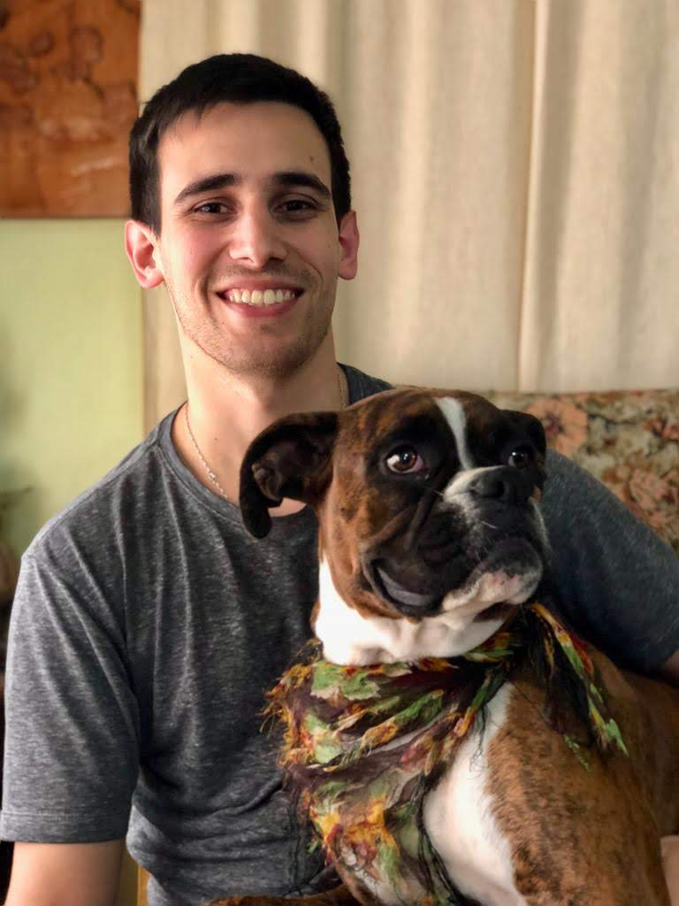

# Presentación

## Estudiante: Maximiliano Toscano

Hola, soy Maxi, tengo 28 años y este es mi tercer año de la Tecnicatura en Programación. 

Actualmente estoy trabajando como técnico electrónico en una fábrica de Quilmes pero bueno me gustaria dentro de poco cambiar y ya dedicarme a la programacíon.

Me gusta pasar tiempo en familia, mirar series y peliculas, jugar al futbol y degustar muchas cervezas :P

Espero tengamos una muy buena cursada entre todos!
